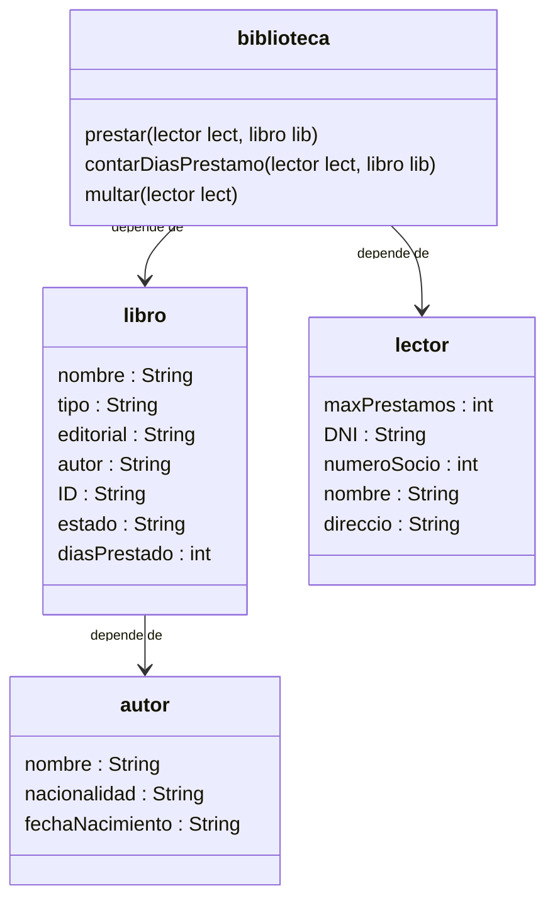

```mermaid
classDiagram
    class libro {
        nombre : String
        tipo : String
        editorial : String
        autor : String
        ID : String
        estado : String
        diasPrestado : int
    }

    class biblioteca {
        prestar(lector lect, libro lib)
        contarDiasPrestamo(lector lect, libro lib)
        multar(lector lect)
    }

    class autor {
        nombre : String
        nacionalidad : String
        fechaNacimiento : String
    }

    class lector {
        maxPrestamos : int
        DNI : String
        numeroSocio : int
        nombre : String
        direccio : String
    }
    biblioteca "depende de" --> libro
    biblioteca "depende de" --> lector
    libro "depende de" --> autor
```