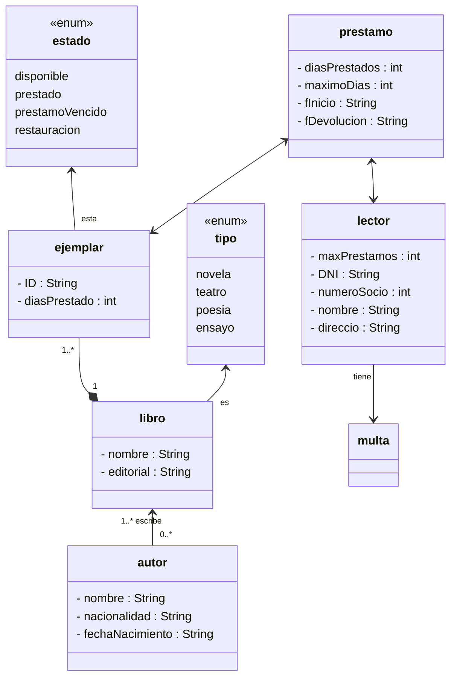

```mermaid
classDiagram
    class libro {
        - nombre : String
        - editorial : String
    }

    class ejemplar {
        - ID : String
        - diasPrestado : int 
    }

    class tipo {
        <<enum>>
        novela
        teatro
        poesia
        ensayo
    }

     class estado {
        <<enum>>
        disponible
        prestado
        prestamoVencido
        restauracion
    }

    class autor {
        - nombre : String
        - nacionalidad : String
        - fechaNacimiento : String
    }

    class lector {
        - maxPrestamos : int
        - DNI : String
        - numeroSocio : int
        - nombre : String
        - direccio : String
    }

    class prestamo {
        - diasPrestados : int
        - maximoDias : int
        - fInicio : String
        - fDevolucion : String
    }

    class multa {

    }

    libro "1..* escribe"<--"0..*" autor
    ejemplar "1..*" --* "1"libro
    estado <--"esta" ejemplar
    tipo <--"es" libro
    prestamo <--> lector
    prestamo <--> ejemplar
    lector "tiene"--> multa
```