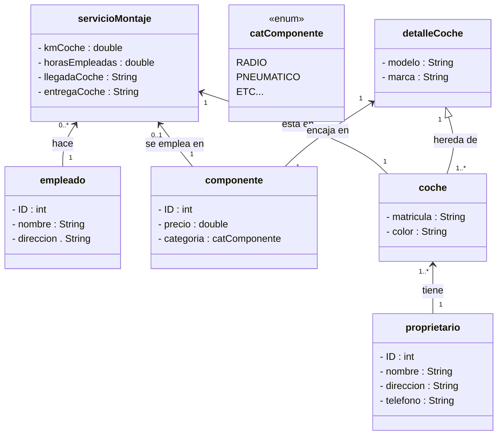

```mermaid
classDiagram

class empleado{
    - ID : int
    - nombre : String
    - direccion . String
}

class servicioMontaje {
    - kmCoche : double
    - horasEmpleadas : double
    - llegadaCoche : String
    - entregaCoche : String
}

class componente {
     - ID : int
    - precio : double
    - categoria : catComponente
}

class catComponente {
    <<enum>>
    RADIO
    PNEUMATICO
    ETC...
}

class coche {
    - matricula : String
    - color : String
}

class detalleCoche {
    - modelo : String
    - marca : String
}

class proprietario {
    - ID : int
    - nombre : String
    - direccion : String
    - telefono : String
}

servicioMontaje "0..*" <-- "1" empleado : hace
servicioMontaje "1" <-- "1" coche : esta en
servicioMontaje "0..1" <-- "1" componente : se emplea en

detalleCoche "1" <-- "1" componente : encaja en

coche "1..*" <-- "1" proprietario : tiene
detalleCoche "1" <|-- "1..*" coche : hereda de

```